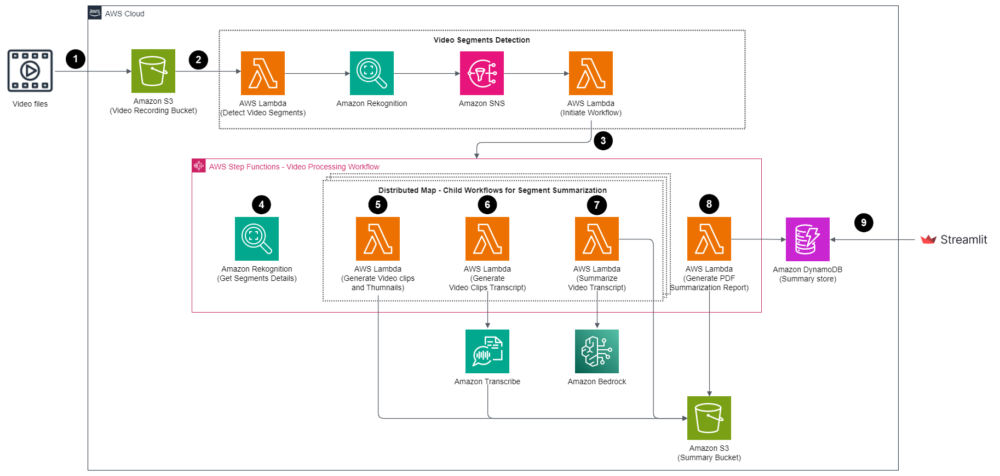

# Video Summary Report Using Generative AI and Serverless on AWS

This project showcases an automated method for creating comprehensive video summary reports utilizing Amazon Bedrock with the AI21 Labs Jurassic-2 Ultra model. The process involves automating the extraction of images from each frame of video presentations and generating corresponding text summaries. Additionally, it generates a consolidated PDF report that merges each frame's image with its respective text summary.

The resultant PDF report functions as a structured, visual, and textual reference for the video content. By combining images with text summaries, it ensures the meticulous preservation of crucial visual elements such as slides, charts, and diagrams. Moreover, it plays a pivotal role in extracting key points, explanations, and vital information from the video content. This enables users to swiftly review and comprehend the essential aspects of educational presentations without the necessity of watching the entire video, significantly boosting overall efficiency.

## Usage

1. Go to the 'video-summarization-serverless/test/' directory.
2. Upload a video file to the S3 bucket:

`aws s3 cp AWS-TechTalk-S3-Lifecycle.mp4 s3://<video-bucket-name>/video-files/AWS-TechTalk-S3-Lifecycle.mp4`

3. Replace <video-bucket-name> with the bucket name copied earlier.
4. After a few minutes, the video-processing-workflow will be triggered. Once the workflow is completed, run the Streamlit app to view the summary:
`pip install -r requirements.txt`
`streamlit run app.py`

5. Clean Up: Go to the `video-summarization/ directory`. 
Empty the video bucket:
`aws s3 rm s3://<video-bucket-name> --recursive`

Delete the SAM template:
`sam delete --stack-name video-summarization --no-prompts`

## License

This library is licensed under the MIT-0 License. See the LICENSE file.

## DISCLAIMER

The solution architecture sample code is provided without any guarantees, and you're not recommended to use it for production-grade workloads. The intention is to provide content to build and learn. Be sure of reading the licensing terms.
